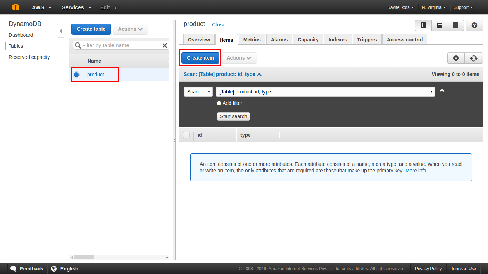
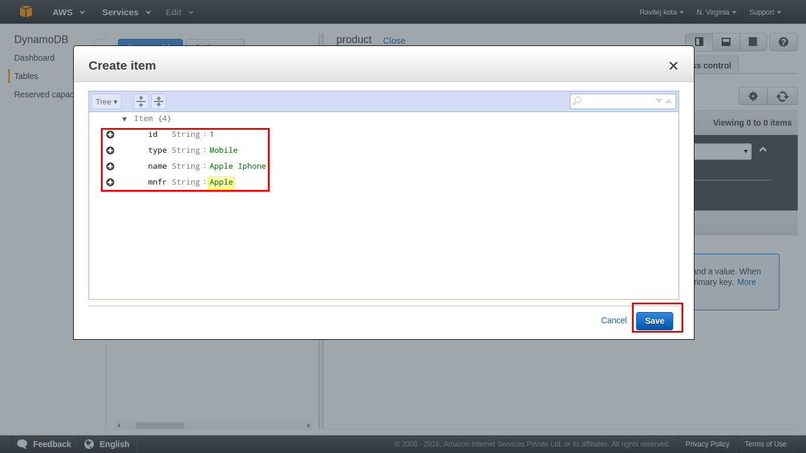
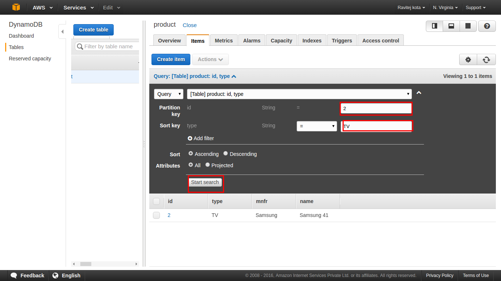
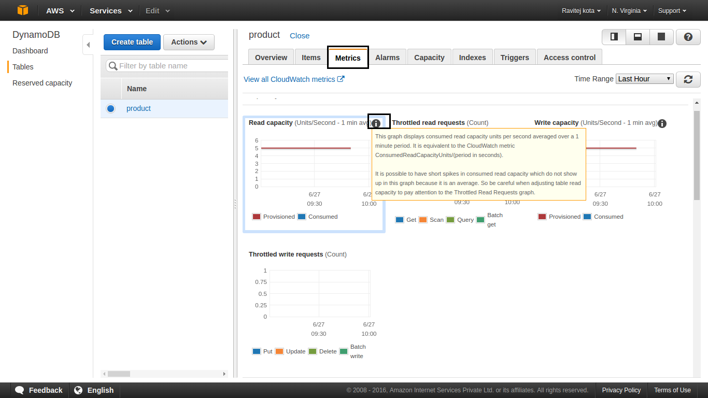

# DynamoDB

### Introduction

- Amazon DynamoDB is a fully managed and cloud-hosted NoSQL database
- NoSQL databases allow us to have a schema-less design for the tables
- We only need to define the key, and the rest of the attributes can be defined at the time of record insertion itself.
-  It is consistent and predictable performance, flexible data modelling, and durability.

### Terminology

| Term | Description |
| ------| -----------|
| Attribute|Entry in a item, which is a key value pair, in dynamodb |
| Item|Individual row in a dynamodb table |
| Table| A dynamodb table. It is collection of data |
| Datatypes|a) Scalar: Number, String, Binary, Boolean, and Null b) Multi-valued: String Set, Number Set, and Binary Set c) Document: List and Map  |
| Primary Key| |
| Global Seondary Index (GSI) |The Global secondary indexes allow us to query items on non-primary key attributes.|
| Local Secondary Index (LSI)| |
|Projected Attributes | |
| Read Capacity Units (RCU)| |
| Write Capacity Units (WCU)||
|Streams |  |
|IOPS |Input/Output Opearations per second|

### Pre-requisites

- AWS Account 
- Knowledge on AWS CLI / AWS Console

### Objectives

- Creating the DynamoDB table
- Loading data into the table
- Querying data using the DynamoDB
- Deleting the DynamoDB table
- Analyzing DynamoDB metric on CloudWatch
- Downloading and setting up DynamoDB Local
- Setting up AWS Command Line Interface
- Setting up the Eclipse IDE

### Instructions
#### Creating the DynamoDB table

  1. Go to Services -> Select Database -> Click on DynamoDB
     
  2. Click on  Create Table
     
  3. Enter the details Table Name, Primary Key, their data types
     
  4. Click on Create
     
  5. Verify the table and its details
    
     
        
#### Loading data (Create Item) into the table

  1. Select table in which you wish to load the data
  2. Click on  Create Item
     
  3. Enter the data w.r.t fields and Click on save
    
  4. Repeat the Same steps to insert more items

#### Querying/Scanning data using the DynamoDB

  1. Select table in which you wish to query
  2. Select `query` from dropdown and give the conditions, click on search
     
  3. Select `Scan` from dropdown to scan all items
     
 
#### Deleting the DynamoDB table

  1. Select table in which you wish to delete and Click Actions -> Delete table 
     
  2. This will open up a pop-up window, which will ask you for your confirmation. In that Click on Delete
     
  3. This will start the deleting process, which will run for a while and erase the
complete data
     
#### Analyzing DynamoDB metric on CloudWatch

- DynamoDB CloudWatch metrics in order to see the
DynamoDB performance.
- CloudWatch provides real-time monitoring and alerting mechanisms to services provided by DynamoDB.
- you will see various graphs, such as Read Capacity, Throttled Read Requests, Write Capacity, Throttled Write Requests, Read-Write Capacity for Global Secondary Indexes, that we created. It will also show you graphs related to Read/Write Latency and Query/Scan latency for a given time frame.


#### Downloading and setting up DynamoDB Local
DynamoDB Local is a simple .jar fi le that runs on your local machine and mimics the actual
DynamoDB.
  1. [Install Java](https://java.com/en/download/linux_manual.jsp)
  2. Download the DynamoDB latest version
      - [tar.gz format]( http://dynamodb-local.s3-website-us-west-2.amazonaws.com/dynamodb_local_latest.tar.gz)
      - [zip format]( http://dynamodb-local.s3-website-us-west-2.amazonaws.com/dynamodb_local_latest.zip)

  3. Extract the contents and copy the extracted directory to a location of your choice.

  4. To start DynamoDB, open a command prompt window, navigate to the directory where you extracted DynamoDBLocal.jar
      ```
      java -Djava.library.path=./DynamoDBLocal_lib -jar DynamoDBLocal.jar -sharedDb
      Help: java -Djava.library.path=./DynamoDBLocal_lib -jar DynamoDBLocal.jar -help
      ```
  5. Access the built-in JavaScript shell.
       `http://localhost:8000/shell`
     
  6. Export the following environemnt variables in scripts/setup (If we use SDK)
    ```
    export AWS_ACCESS_KEY_ID="AWS_ACCESS_KEY" || “dummyAccessKey”
    export AWS_SECRET_ACCESS_KEY="AWS_SECRET_KEY" || “dummySecretKey”
    export AWS_ACCOUNT="AWS_ACCOUNT" 
    export AWS_REGION="AWS_REGION" || “ap-northeast-1" 
    export AWS_ENDPOINT="dynamodb.$AWS_REGION.amazonaws.com" || http://localhost:8000
    export AWS_DYNAMODB_TBL_PREFIX="ANY_PREFIX" -> This is optional
    ```

#### Setting up AWS Command Line Interface

The AWS Command Line Interface allows us to operate various AWS resources from the command line itself
  1. [Install AWS CLI](http://docs.aws.amazon.com/cli/latest/userguide/installing.html)
  2. Open cmd prompt and type `aws configure`
  3. Enter the credentials and region
  4. To List the API reference `aws dynamodb help`
  5. To know particular cmd help  `aws [options] <command> <subcommand> [parameters] list-tables help`
  6. Eg:`
     ```
     aws list-tables 
     aws dynamodb query --table-name product --key-conditions file://conditions.json
     ```
  
#### Setting up the Eclipse IDE

  1. [Install Ecllipse](https://eclipse.org/downloads/)
  2. Open Eclipse, and go to Help | Install New Software
  3. In the Work with box, type http://aws.amazon.com/eclipse , and press Enter.
  4. Select AWS Toolkit for Eclipse, and install the plugin:
  5. After that work with AWS explorer.

### References

- http://docs.aws.amazon.com/amazondynamodb/latest/developerguide/Introduction.html
- http://serebrov.github.io/html/2015-02-01-dynamodb-local.html
- https://github.com/awslabs
- https://www.datadoghq.com/blog/top-dynamodb-performance-metrics/


---
<center>***Thank You***<br/><span style="color:orange;"><i>Sivaram</i></center>

---