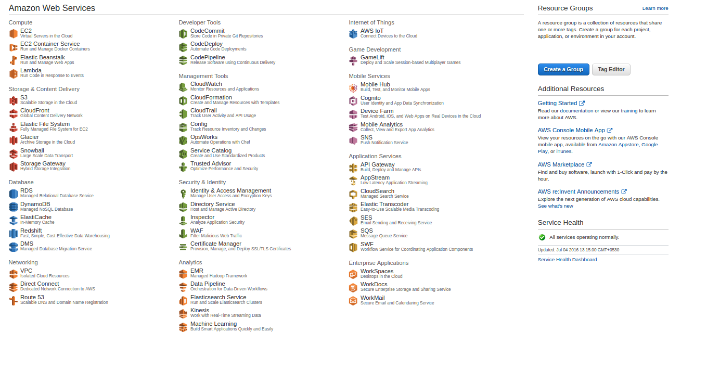
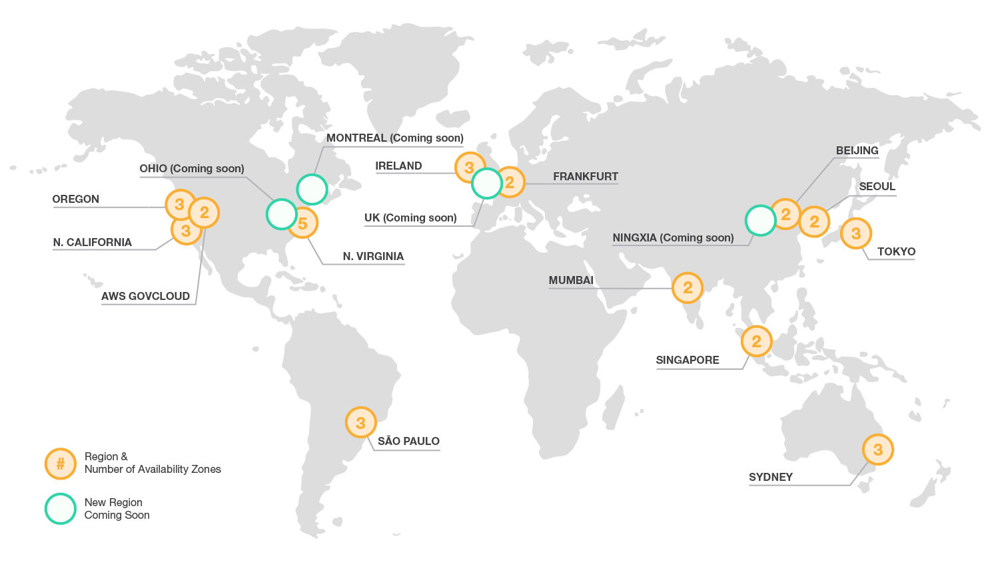

# AWS Services

* [Compute](#compute)
* [Storage && Content Delivery](#storage)
* [Database](#database)
* [Network](#network)
* [Developer Tools](#dev)
* [Management Tools](#mgmt)
* [Security && Identity](#secure)
* [Analytics](#analytics)
* [IOT](#iot)
* [Mobile Services](#mobile)
* [Application Services](#app)
* [Enterprise Applications](#erp)
* [Game Development](#game)

## Global Infrastructure

### <a name="compute" href="#">Compute</a>

|Name |Description|
|-----|-----------|
|Elastic Compute Cloud (EC2)|-----------|
|EC2 Container Service (ECS)|-----------|
|Elastic Bean Stack (EBS)||
|Lambda||

### <a name="storage" href="#">Storage && CDN</a>

|Name |Description|
|-----|-----------|
|Simple Storage Service (S3)|-----------|
|Cloud Front|-----------|
|Elastic File System (EFS)||
|Glacier||
|Snowball||
|Storage Gateway||
### <a name="database" href="#">Database</a>

|Name |Description|
|-----|-----------|
|Relational Database Service (RDS)|-----------|
|Dynamo DB||
|Elastic Cache||
|Redshift||
|Database Migration Service (DMS)||

### <a name="network" href="#">Network</a>

|Name |Description|
|-----|-----------|
|Virtual Private Cloud (VPC)|-----------|
|Direct Connect||
|Route 53||

### <a name="dev" href="#">Development Tools</a>

|Name |Description|
|-----|-----------|
|Code Commit|-----------|
|Code Deploy|-----------|
|Code Pipeline||

### <a name="mgmt" href="#">Management Tools</a>

|Name |Description|
|-----|-----------|
|Cloud Watch|-----------|
|Cloud Formation (CFT)|-----------|
|Cloud Trail|-----------|
|Config||
|Opsworks||
|Service Catalog||
|Trusted Advisor||

### <a name="secure" href="#">Security && Identity</a>

|Name |Description|
|-----|-----------|
|Identity & Access Management (IAM)|-----------|
|Directory Service|-----------|
|Inspecter ||
|Web Application Firewall (WAF)||
|Certificate Manager||

### <a name="analytics" href="#">Analytics</a>

|Name |Description|
|-----|-----------|
|Elastic MapReduce (EMR)|-----------|
|Data Pipeline|-----------|
|Elastic Search Service (ESR)  ||
|Kinesis||
|Machine Learning||

### <a name="analytics" href="#">IOT</a>

|Name |Description|
|-----|-----------|
|Internet Of Things (IOT)|-----------|

### <a name="mobile" href="#">Mobile Services</a>

|Name |Description|
|-----|-----------|
|Mobile Hub|---------|
|Cognito||
|Device Farm||
|Mobile Analytics||
|Simple Notification Service (SNS)||

### <a name="app" href="#">Application Services</a>

|Name |Description|
|-----|-----------|
|API Gateway|---------|
|App Stream||
|Cloud Search||
|Elastic Transcode||
|Simple Email Service (SES)||
|Simple Queue Service (SQS)||
|Simple Workflow Service (SWF)||

### <a name="erp" href="#">EnterPrise Applications</a>

|Name |Description|
|-----|-----------|
|Work Spaces|-----------|
|Work Docs||
|Work Mail||

### <a name="game" href="#">Game Development</a>

|Name |Description|
|-----|-----------|
|Game Lift |-----------|

