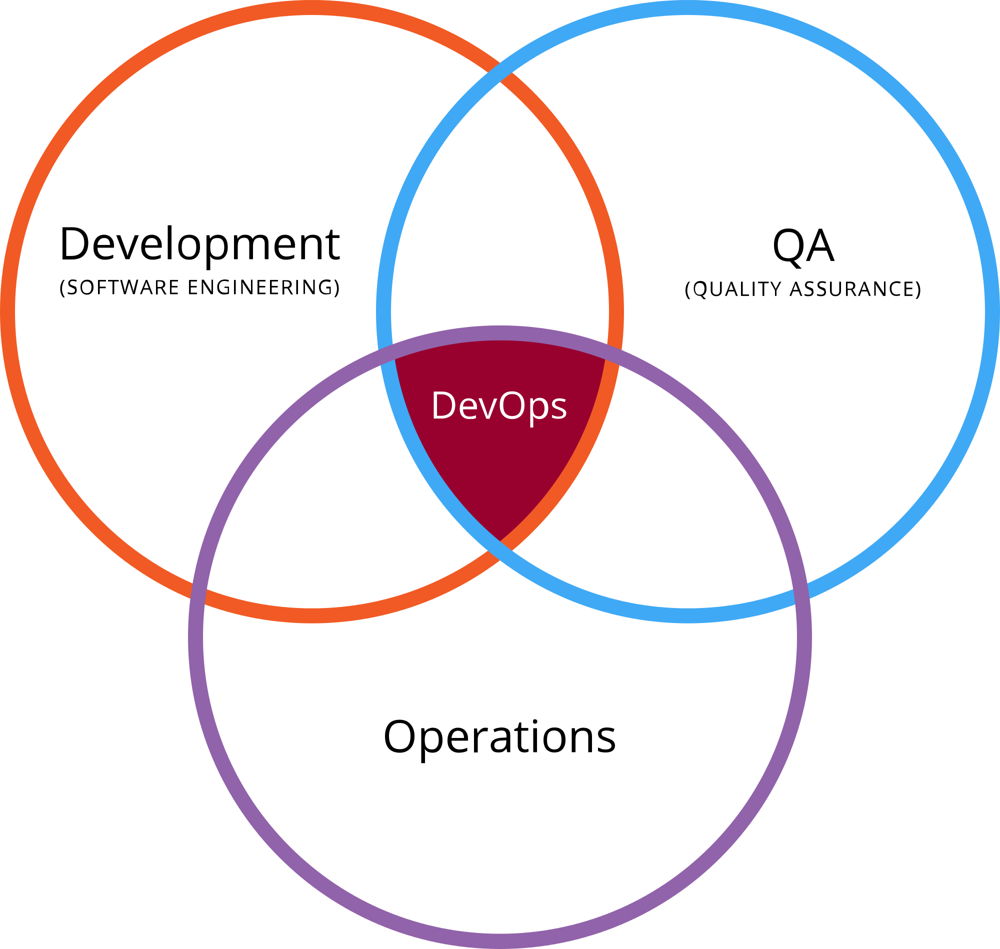
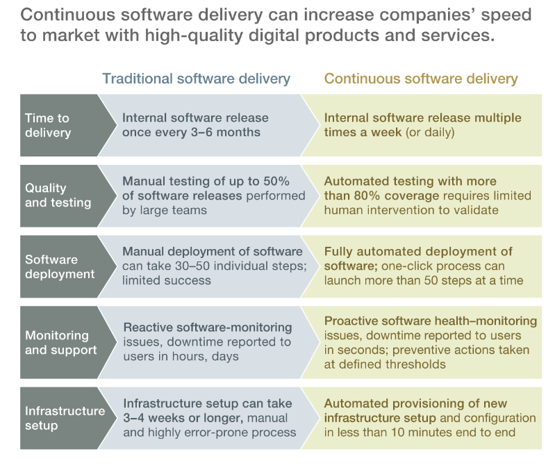
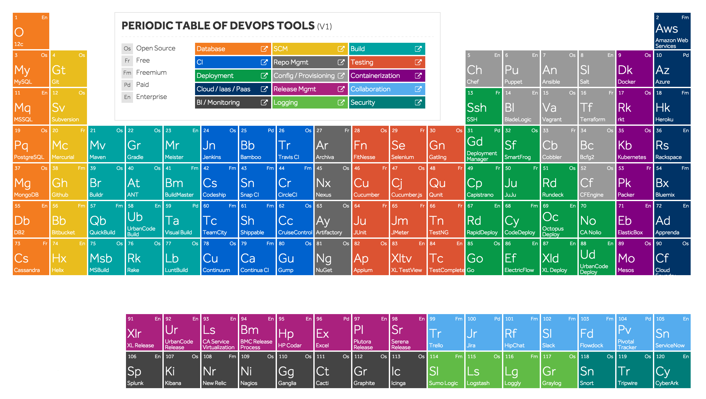
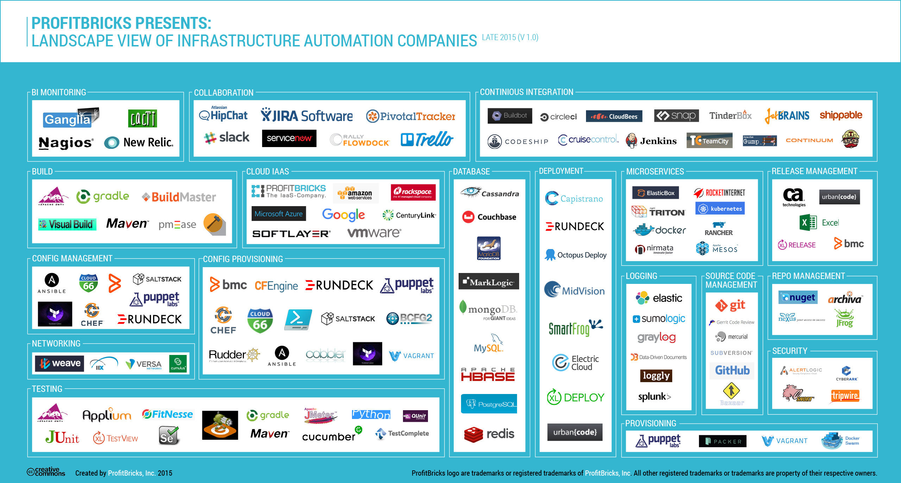

## DevOps (Dev + Operations)

### Introduction

* <u>**In General**</u>
  - It is a process/culture used to enhance the dev and operations
  - Who touches all parts of SDLC
  - Keep it simple and clear

* <u>**Technical**</u>
  - It is a mindset that enables Communication, Collabaration, Integration between Software Developers, Quality Engineers and Information Technology (Operators) Professionals to enable rapid evolution of product or services.
  - It focuses on delivering software product faster and lowering the failure rate of releases.

### Dev and Ops Roles

#### Roles of Developers
 - Develop/modify applications
 - Try new Technologies
 
#### Roles of Operations
  - Build, Deploy and release
  - Performanance and avaliability / maintain stability
  - Create or enhance Services
  

### Devops Eco System
 
  * SCM: SVN, Git
  * Scripting: Shell, Python, Perl, Ruby on Rails
  * Web App Servers: Apcahe, IIS, Tomcat, Nginx
  * Databases: MySql, MongoDB, PostgreSql
  * ElasticCache: Redis
  * Build Tools: Ant, Maven
  * Continuous Integration: Hudson/Jenkins, Codeship
  * Configuration Management: Puppet, Chef
  * Cloud: AWS
  * Code Analysis: Sonar
  * Containerization: Docker
  * Monitoring: Nagious
  * Metrics: StatsD, Collectd, graphite
  * Binary Repo Manager: Nexus, Artifactory, s3
  * Misc: CodeCommit, CodeDeploy, CodePipline

---

### Checklist for Linux-build-server (If slow)
| Level  | Description |
| ----- | ------------|
| Application Level troubleshooting | RAM related issues, Disk I/O read write issues, Disk Space related Issues, etc.|
| System Level troubleshooting | Check for Application log file OR application server log file, system performance issues, Web Server Log – check HTTP, tomcat log, etc. or check jboss, weblogic logs to see if the application server response/receive time is the issues for slowness, Memory Leak of any application |
| Dependent Services troubleshooting | Antivirus related issues, Firewall related issues, Network issues, SMTP server response time issues, etc.|
  

### References
- http://devops.com/
- https://www.reddit.com/r/devops/
- http://it-ebooks.info/search/?q=devops
- http://docker-books.com/
- [dev-ops-bookmarks](http://www.devopsbookmarks.com/)
- [dev-ops-img](https://www.google.co.in/search?biw=1301&bih=605&tbm=isch&sa=1&q=devops+%3D+dev+%2B+ops)

---

***Thank You*** <i>Sivaram</i>

---

